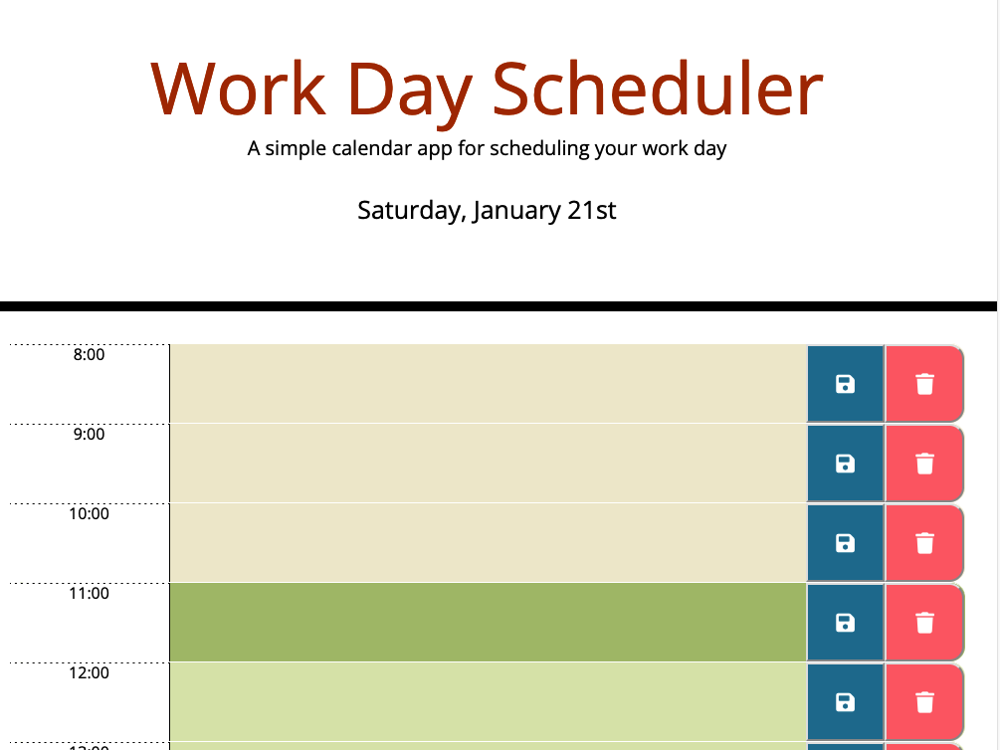

# Work Day Scheduler
Welcome to Daily Planner, a simple yet powerful app that helps you stay on top of your schedule. With Daily Planner, you can easily plan out your day, hour by hour, and never miss a meeting or deadline again.

## Key Features
Plan your schedule hour by hour
Easily add and delete events
Save your schedule and events to local storage
View past, present, and future events based on the current hour
Displays the current day at the top of the page
## Screenshot

## How to Use
Click on the deployment link and view the current day at the top of the page.
Scroll through the schedule and view past, present, and future events based on the current hour.
Click on the text area next to the hour to add an event for that time.
Click on the save button to save your event.
Click on the trash button to delete an event.
## Features
Displays a schedule of the current day, from 9am to 5pm
Color codes each hour based on whether it is in the past, present, or future
Saves events to local storage
Events persist even after refreshing the page or closing the browser
## Future Development
* Connect the app to a database like Supabase to enable sharing and collaboration
* Add the ability to switch between different days
* Add the ability to set reminders for events
## Technologies Used
* JavaScript
* jQuery
* Moment.js
* Bootstrap
* Font Awesome
## Try it out
You can try out the Work Day Scheduler by visiting the deployed website here:
https://aloosli.github.io/work-day-scheduler/
